# RTL-to-GDSII Design Flow of a 64-bit Vedic MAC Unit

---

## 🔷 Introduction
A Multiply–Accumulate (MAC) unit is a fundamental arithmetic block used extensively in
Digital Signal Processing (DSP), image processing, machine learning accelerators, and
high-performance computing systems. A MAC performs multiplication followed by
accumulation in a single operation, making it critical for compute-intensive applications.

This project presents the complete **RTL-to-GDSII implementation of a 64-bit Vedic
Multiply–Accumulate (MAC) unit** using **Verilog HDL** and **Cadence EDA tools**
targeting **90nm CMOS technology**. The design leverages the
**Urdhva–Tiryagbhyam** Vedic multiplication technique to achieve high-speed and
area-efficient arithmetic operations.

---

## 🧠 MAC Architecture Overview
The 64-bit Vedic MAC architecture consists of:
- Vedic multiplier based on Urdhva–Tiryagbhyam  
- 64-bit accumulator  
- Control logic with enable and reset  
- Clocked registers for sequential accumulation  

  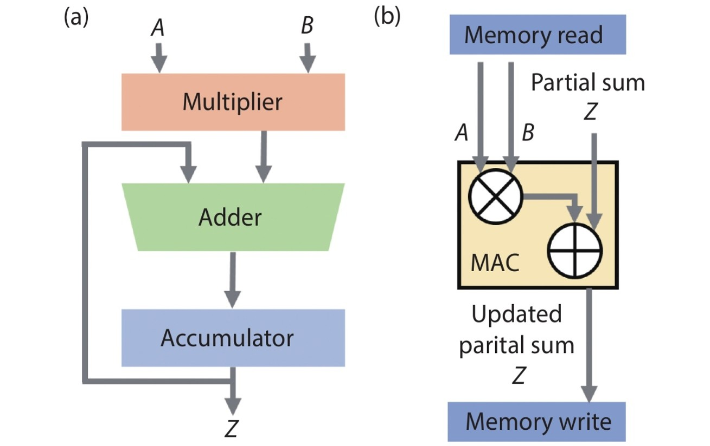

<i>Block diagram of the 64-bit Vedic MAC unit</i>

---

## 1️⃣ RTL Design
The RTL was implemented in **Verilog HDL** using a hierarchical and modular approach.
Smaller Vedic multiplier blocks are recursively combined to form the 64-bit multiplier.

  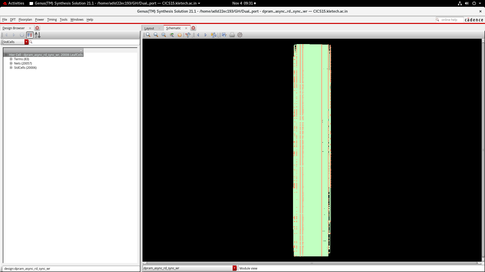

<i>RTL schematic of the 64-bit Vedic MAC</i>

---

## 2️⃣ Functional Verification
Functional verification was performed using a dedicated Verilog testbench. Simulation
waveforms confirm correct multiplication, accumulation, reset, and enable behavior.

  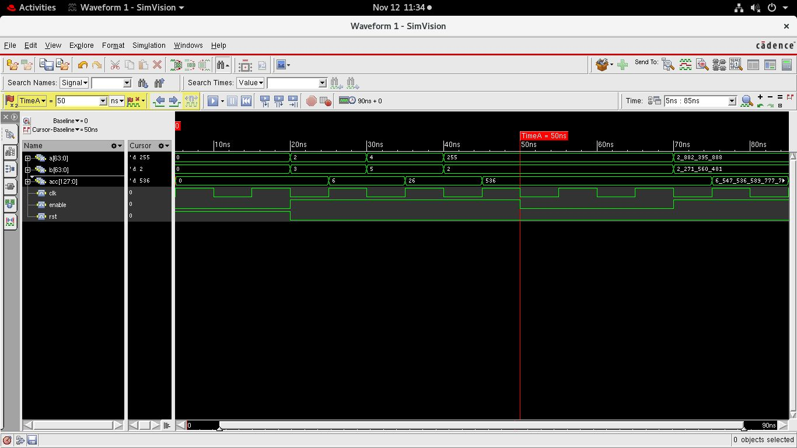

<i>Simulation waveform verifying MAC functionality</i>

---

## 3️⃣ Example: Partial Product Generation
In a conventional binary multiplier, partial products are generated sequentially,
increasing propagation delay. In contrast, the Vedic multiplier generates partial
products in parallel using vertical and crosswise operations, significantly improving
performance.

  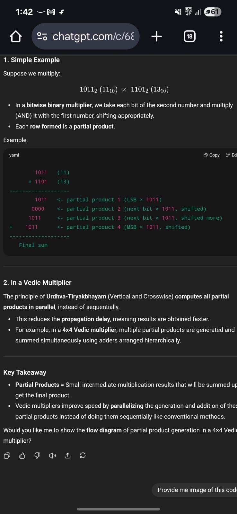

<i>Partial product generation comparison</i>

---

## 4️⃣ Floorplanning
Floorplanning was carried out in **Cadence Innovus** by defining the core area, aspect
ratio, and standard-cell rows to reduce congestion and improve timing.

  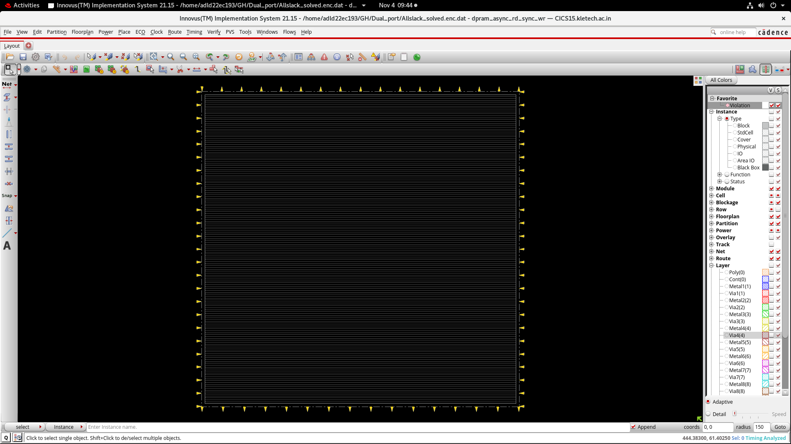

<i>Floorplan showing core boundary and layout organization</i>

---

## 5️⃣ Pin Planning (IO Planning)
IO pins were uniformly distributed around the periphery of the core using an automated
`.io` file to improve routability and signal integrity.

  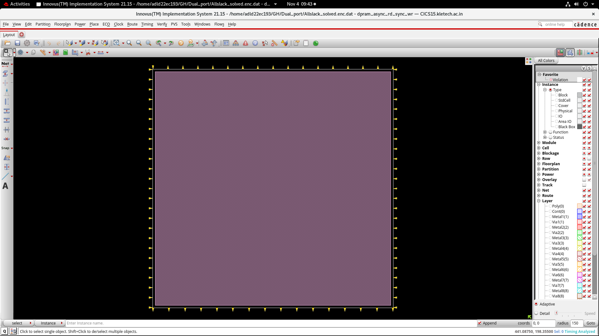

<i>IO pin placement around the core</i>

---

## 6️⃣ Power Planning
A robust power distribution network was implemented using VDD/VSS rails and power
stripes across multiple metal layers to ensure reliable power delivery.

  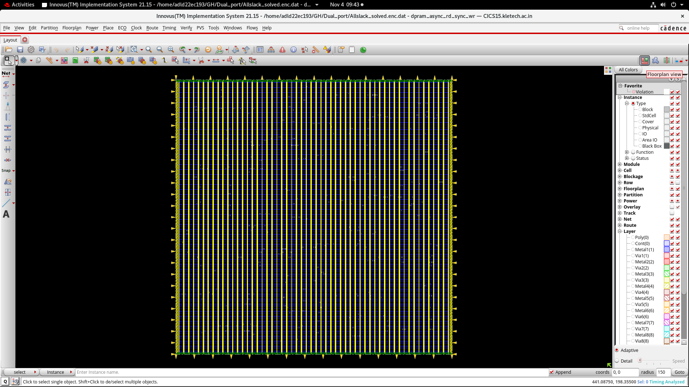

<i>Power planning with VDD/VSS stripes</i>

---

## 7️⃣ Standard Cell Placement
Standard cells were placed to minimize wirelength, reduce congestion, and improve
timing closure. Arithmetic blocks were clustered to optimize critical paths.

  

<i>Standard-cell placement view</i>

---

## 9️⃣ Routing
Global and detailed routing were completed while adhering to 90nm design rules.

  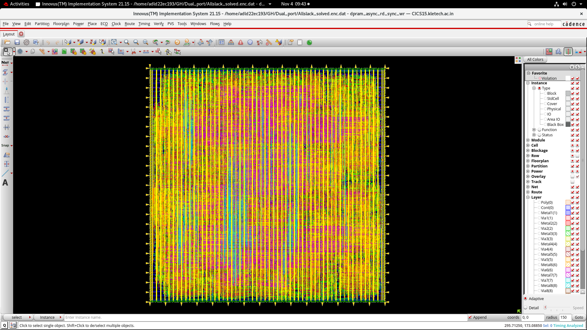

<i>Fully routed layout</i>

---

## 🔟 Antenna Check
Antenna rule checks were performed and violations were resolved using diode insertion
and routing optimization.

  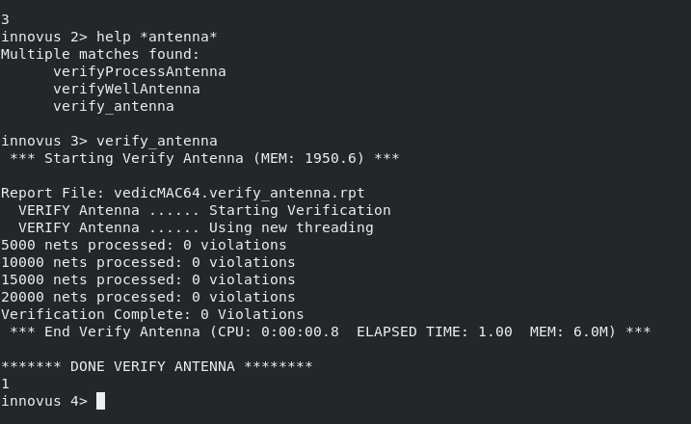

<i>Antenna check report</i>

---

## 1️⃣1️⃣ Physical Verification (DRC)
The design completed Design Rule Checking (DRC) with zero violations.

  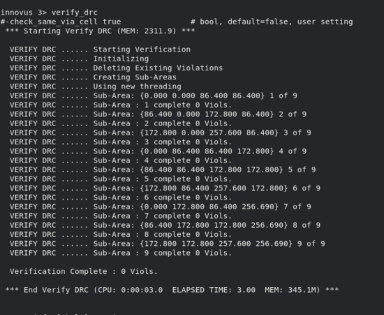

<i>DRC clean report</i>

---

## 1️⃣2️⃣ Area Utilization
Post-layout area analysis confirms efficient utilization of silicon area.

  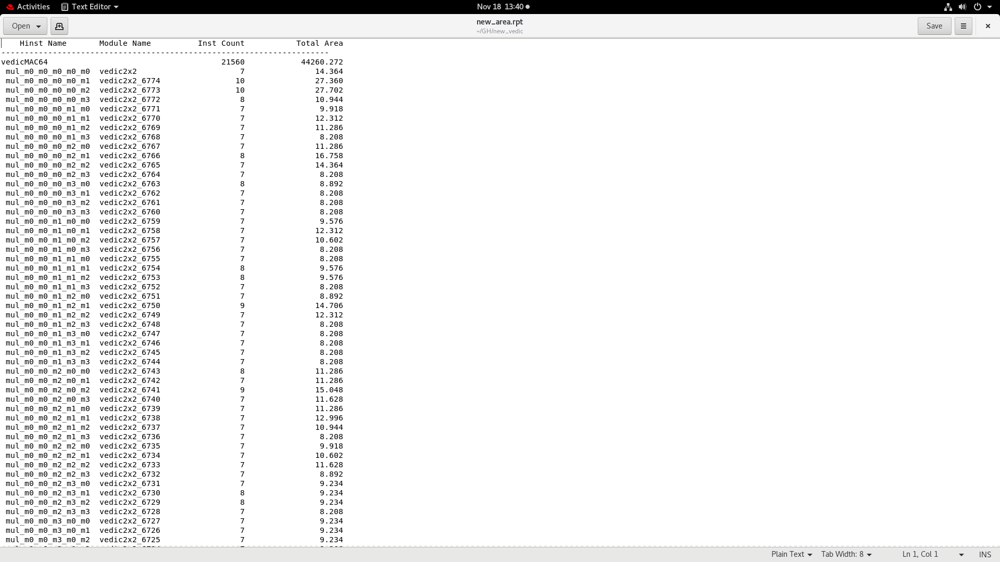

<i>Final area utilization</i>

---

## 1️⃣4️⃣ Post-Layout Timing Analysis
Post-layout STA confirms **positive timing slack**, indicating successful timing closure.

  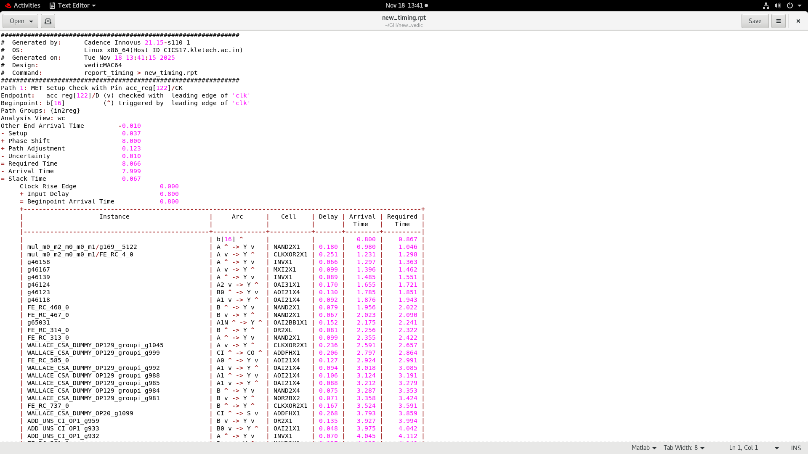

<i>Post-layout timing analysis</i>

---

## 1️⃣5️⃣ GDSII Generation
The final GDSII layout was generated after successful routing and physical verification.

⚠️ **Note:** GDSII and standard-cell libraries are excluded due to EDA licensing
and NDA restrictions.
